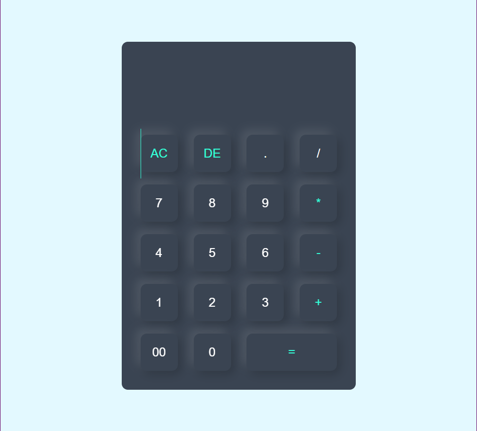

# Web Calculator

A simple, stylish web-based calculator built with HTML, CSS, and JavaScript. This project demonstrates a responsive calculator UI with basic arithmetic operations, designed for ease of use and modern aesthetics.

## Features

- Addition, subtraction, multiplication, and division
- Clear (AC) and delete (DE) functions
- Responsive design for desktop and mobile
- Clean and modern user interface

## How to Use

1. **Clone or Download** this repository.
2. Open `index.html` in your web browser.
3. Use the calculator as you would a physical one!

## Live Demo

Try it out here:  
[Web Calculator Live](https://ashiqursaron.github.io/Web_Calculator/)  

## Screenshots

  

## Technologies Used

- HTML5
- CSS3
- JavaScript

*Made with ❤️ for learning and fun!*